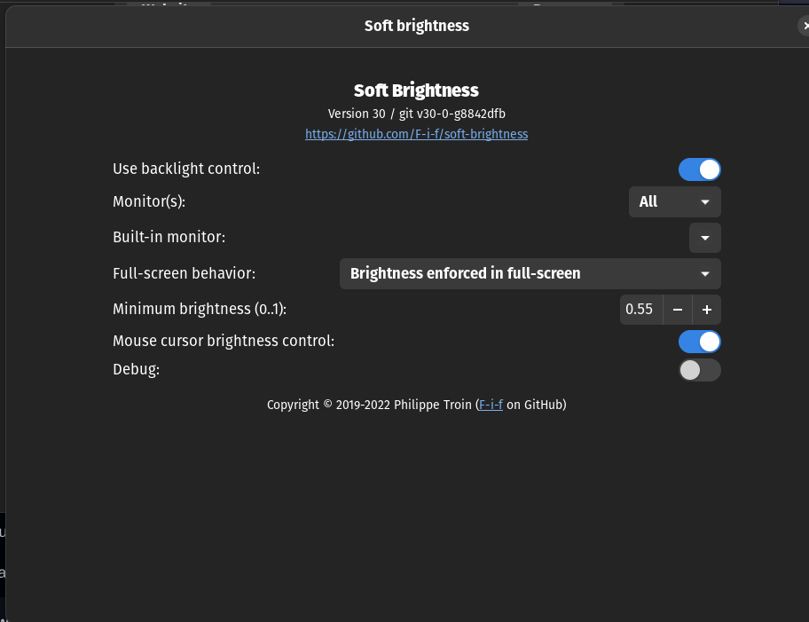

# Brightness Control Issues in Gnome

This issue is really common with laptops. You might find that neither does your gnome slider nor do the function controls change the brightness of your screen as intended.

## Solution ##
1. ### By using Gnome extensions ###

    - Install the soft brightness extension from [here](https://extensions.gnome.org/extension/1625/soft-brightness/)

    - After installing go to the `Extensions` menu and change the settings as shown in this screenshot 

    - Now the default gnome slider would be replaced by the brightness extension slider and you can also use your function keys to control the brightness of your screen.

    - **Note : You can adjust the Minimum brightness according to your requirements, I find 0.55 sufficient enough for me.**

**If you have any other alternative solutions for this problem you are free to contribute to this branch** 